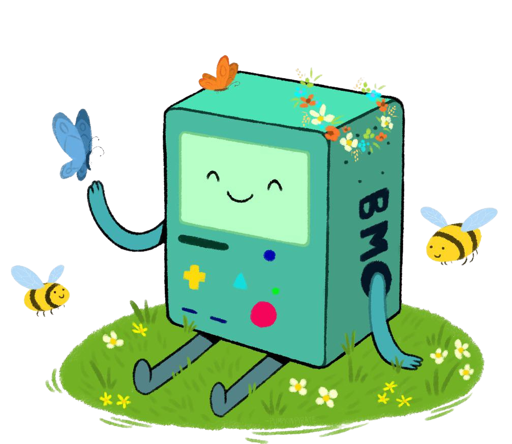

<p align="center">
  
</p>

<h1 align="center">bmo</h1>

<p align="center">
  A tiny installer for Claude Code skills.
  <br>
  No marketplaces. No plugin wrappers. No manual cloning.
</p>

```bash
bmo add owner/repo
bmo inspect owner/repo
bmo list
bmo update --all
bmo remove skill-name
bmo doctor
bmo upgrade    # upgrade bmo itself to the latest release

bmo add owner/repo here         # install into this project
bmo add owner/repo everywhere   # install globally (the default)

bmo init       # install the skill bmo ships with
bmo add bmo    # ...or restore it if you deleted it
```

## What It Does

`bmo` installs standalone [Claude Code](https://claude.com/claude-code) skills. A skill is a folder containing a `SKILL.md` file.

It resolves a source (GitHub repo, local path, or zip URL), finds installable skill folders, validates the `SKILL.md` frontmatter, copies the selected folder into Claude Code's skills directory, and records metadata so the skill can be listed, updated, or removed later.

## The bundled `bmo` skill

`bmo` ships with its own tiny Claude Code skill baked into the binary (the
`skills/bmo/` folder, embedded at build time). It teaches Claude Code how to
author skills to `bmo`'s contract — the folder layout, `SKILL.md` frontmatter
rules, naming constraints, and repo structure — so anything Claude creates is
immediately installable with `bmo add`.

You don't have to install it by hand. **The first time you run any `bmo`
command, bmo installs the `bmo` skill globally** (once) and prints a one-line
note. A sentinel at `~/.bmo/.bootstrapped` records that this happened, so it
won't fight you if you later remove it.

You can also manage it explicitly:

```bash
bmo init       # install (or refresh) the bundled bmo skill
bmo add bmo    # the same thing — restore it if you deleted the folder
bmo add self   # alias for `bmo add bmo`
```

Because the skill is embedded in the binary, `bmo init` / `bmo add bmo` work
**fully offline** — no GitHub clone, no network. `bmo add bmo` is the answer to
"I accidentally deleted the skill, how do I get it back?"

## What It Is Not

`bmo` is **not** a marketplace, package registry, dependency manager, plugin installer, publisher, signing system, or background service.

It does **not** execute downloaded code, run install hooks, or install dependencies.

---

## Install

**From source:**

```bash
go install github.com/justin06lee/bmo@latest
```

**Or build locally:**

```bash
git clone https://github.com/justin06lee/bmo
cd bmo
go build -o bmo .
```

---

## Quick Start

```bash
# Inspect a skill before installing
bmo inspect owner/repo

# Install a skill globally
bmo add owner/repo

# Install to the current project instead
bmo add --project owner/repo

# List installed skills
bmo list

# Update every installed skill
bmo update --all

# Remove a skill
bmo remove skill-name

# Run diagnostics
bmo doctor

# (Re)install the skill bmo ships with — also runs automatically on first use
bmo init
```

---

## Commands

### `add`

Install a skill from a source.

```bash
bmo add SOURCE [--project] [--name NAME] [--force] [--yes] [--dry-run]
```

| Flag | Description |
|------|-------------|
| `--project` | Install to the current project's `.claude/skills/` instead of globally |
| `--name` | Override the skill name (must match `^[a-z0-9-]+$`) |
| `--force` | Overwrite an existing installation with the same name |
| `--yes` | Skip all confirmation prompts |
| `--dry-run` | Show what would be installed without writing anything |

**Source formats:**

| Format | Example |
|--------|---------|
| GitHub repo | `owner/repo` or `github:owner/repo` |
| GitHub with subpath | `owner/repo/path/to/skill` |
| GitHub with ref | `owner/repo@v1.0.0` |
| GitHub with subpath + ref | `owner/repo/path@branch` |
| Local directory | `./path/to/skill` |
| Zip URL | `https://example.com/skill.zip` |
| The bundled bmo skill | `bmo` (or `self`) — installs the embedded skill, offline |

The `github:` prefix is optional — a bare `owner/repo` is treated as GitHub. Local relative paths must use a `./` (or `../`) prefix so they aren't mistaken for a repo.

When no ref is specified, bmo tries `main` first, then falls back to `master`.

### `init`

Install the `bmo` skill that ships bundled inside the binary.

```bash
bmo init [--project]
```

| Flag | Description |
|------|-------------|
| `--project` | Install into the current project's `.claude/skills/` instead of globally |

This is the explicit form of the first-run auto-install. It works offline and
refreshes the skill if it's already installed. `bmo add bmo` does the same thing.

### `inspect`

Preview a skill source without installing.

```bash
bmo inspect SOURCE
```

Shows the skill name, description, file count, notable files, and any executable file warnings. Useful for vetting a skill before running `add`.

### `list`

List installed skills.

```bash
bmo list [--project] [--global] [--json]
```

| Flag | Description |
|------|-------------|
| `--project` | Show only project-installed skills |
| `--global` | Show only globally-installed skills |
| `--json` | Output as JSON for programmatic use |

By default (no flags), lists both global and project skills.

### `remove`

Uninstall a skill.

```bash
bmo remove SKILL_NAME [--project] [--global] [--yes]
```

| Flag | Description |
|------|-------------|
| `--project` | Remove from the current project |
| `--global` | Remove from the global install directory |
| `--yes` | Skip confirmation |

Removes the skill directory from disk and its entry from the metadata file.

### `update`

Reinstall a skill from its original source.

```bash
bmo update SKILL_NAME [--project] [--global] [--yes] [--dry-run]
bmo update --all [--project] [--global] [--yes] [--dry-run]
```

| Flag | Description |
|------|-------------|
| `--all` | Update every tracked skill |
| `--project` | Update only project-installed skills |
| `--global` | Update only globally-installed skills |
| `--yes` | Skip confirmation |
| `--dry-run` | Show what would be updated without writing anything |

Re-resolves the original source and reinstalls. Existing skill files are overwritten. The original `InstalledAt` timestamp is preserved.

### `doctor`

Run system diagnostics.

```bash
bmo doctor
```

Checks:
- Global and project skills directories exist and are writable
- Global and project metadata files are valid JSON
- Every tracked skill path exists and contains `SKILL.md`
- No duplicate skill names across scopes
- `CLAUDE_CONFIG_DIR` environment variable status

---

## Scopes

Skills can be installed in two scopes:

### Global

Installed to `$CLAUDE_CONFIG_DIR/skills/` when the `CLAUDE_CONFIG_DIR` environment variable is set, otherwise `~/.claude/skills/`.

Global metadata is stored at `~/.bmo/skills.json`.

### Project

Installed to `<project-root>/.claude/skills/`.

Project metadata is stored at `<project-root>/.claude/bmo-lock.json`.

Both scopes can coexist. A skill name collision across scopes triggers a warning during `bmo doctor`.

### Picking a scope: `here` / `everywhere`

`add`, `init`, `list`, `remove`, and `update` take an optional location keyword
as a plain positional word — a friendlier alias for the `--project` / `--global`
flags:

| Keyword | Meaning | Equivalent flag |
|---------|---------|-----------------|
| `here` | the current project (`./.claude/skills`) | `--project` |
| `everywhere` | globally (the default) | `--global` |

```bash
bmo add owner/repo here          # install into this project
bmo add owner/repo everywhere    # install globally (same as the default)
bmo list here                    # list only this project's skills
bmo remove cool-skill here       # remove from this project
bmo update --all here            # update this project's skills
```

The keyword may appear before or after the other argument, so
`bmo add here owner/repo` works too. Commands default to **global** when no
keyword or flag is given (`bmo list` with neither still lists both scopes). The
`--project` / `--global` flags continue to work and can be used interchangeably.

---

## Security

**`bmo` copies files only.** It never executes downloaded code, runs install scripts, or invokes package managers.

When a skill contains files with executable extensions (`.py`, `.sh`, `.js`, `.rb`, etc.) or notable dependency files (`requirements.txt`, `package.json`, `Cargo.toml`, etc.), bmo prints a warning before installation so you can review what you're installing.

Additional hardening:

- **Zip-slip protection** — entries in downloaded archives that resolve outside the extraction directory are rejected.
- **Size caps** — downloads and extracted archives are bounded (256 MiB) to guard against decompression bombs.
- **No symlink following** — `bmo` refuses to copy symlinks when installing a skill, so a skill folder can't read files outside its tree.
- **Scoped removal** — `bmo remove` refuses to delete anything outside the managed skills directory.

---

## Metadata

Metadata is stored as JSON and records every installed skill's name, description, source, path, install times, and scope.

Writes are **atomic** — bmo writes to a temporary file first, syncs it to disk, then renames it over the target. Partial writes are never visible.

---

## Troubleshooting

1. **Run `bmo doctor`** — it checks the most common issues.
2. Ensure `CLAUDE_CONFIG_DIR` is set if you expect skills in a custom location.
3. Check that `~/.bmo/skills.json` or `.claude/bmo-lock.json` is valid JSON.
4. For permission issues, verify the skills directory is writable.
5. Open an [issue](https://github.com/justin06lee/bmo/issues) if problems persist.

---

## Development

```bash
# Run tests
go test ./...

# Run tests with verbose output
go test -v ./...

# Build
go build -o bmo .
```
